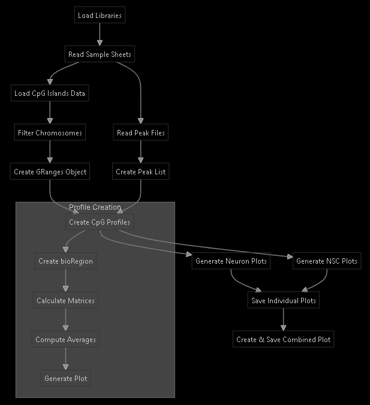
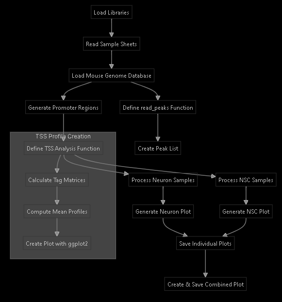

# `cpg_metaprofile_analysis` Explanation:

This R script performs analysis and visualization of MeCP2 binding patterns around CpG Islands

1. **Data Loading**
   - Reads sample information from CSV files for endogenous and exogenous conditions
   - Loads mouse genome annotation database (mm10)
   - Reads CpG Islands data from a BED file

2. **Data Preprocessing**
   - Filters CpG Islands to include only standard chromosomes
   - Converts CpG Islands data into GRanges object (genomic coordinates format)
   - Defines a function `read_peaks()` to read peak files and create GRanges objects
   - Loads all peak files into a list using sample information

3. **Analysis Function**
   The `create_cpg_profiles()` function:
   - Creates a bioRegion around CpG Islands (±3000 bp from center)
   - Calculates binding profiles for both endogenous and exogenous samples
   - Computes average signal across all samples
   - Creates visualization using ggplot2 with different color schemes for different tissues

4. **Visualization**
   - Separates samples by tissue type (Neuron vs NSC) and condition (Endogenous vs Exogenous)
   - Creates individual plots for each tissue type
   - Combines plots into a single figure using patchwork
   - Saves plots as PDF files

## Flow diagram:

# `tss_metaprofile_analysis` Explanation:

This R script analyzes and visualizes MeCP2 binding patterns around Transcription Start Sites (TSS)

1. **Setup & Data Loading**
   - Reads two sample sheets: endogenous and exogenous conditions
   - Loads mouse genome transcription database (mm10)

2. **Peak Processing**
   - Defines `read_peaks()` function to:
     - Read peak files
     - Convert them to GRanges objects
     - Assign unique names to each peak
   - Creates a list of all peaks from all samples

3. **TSS Region Definition**
   - Generates promoter regions (±3000 bp around TSS) using `getPromoters()`

4. **Analysis Function**
   The `create_tss_profiles()` function:
   - Takes endogenous and exogenous peaks, tissue name, and color scheme
   - Calculates binding matrices around TSS for both conditions
   - Computes mean profiles
   - Creates visualization using ggplot2 with tissue-specific color schemes
     - Blue scheme for Neurons
     - Red scheme for NSCs

5. **Sample Processing & Visualization**
   - Separates samples by tissue and condition
   - Generates individual plots for each tissue
   - Creates combined visualization
   - Saves both individual and combined plots as PDFs

## flow diagram:

**Key Components:**
1. **Input Data**
   - Sample sheets containing information about endogenous and exogenous samples
   - Peak files
   - Mouse genome transcription database

2. **Analysis Parameters**
   - TSS window: ±3000 bp
   - Tissue-specific color schemes
   - Separate analysis for Neurons and NSCs

3. **Output Files**
   - `results/neuron_tss_profile.pdf`
   - `results/nsc_tss_profile.pdf`
   - `results/combined_tss_profiles.pdf`
