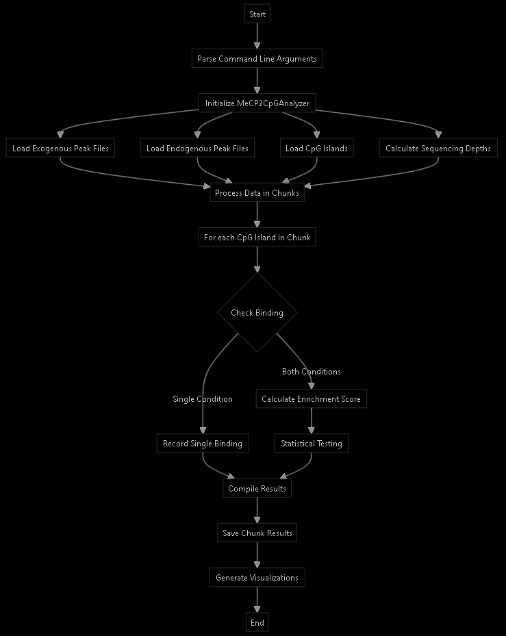
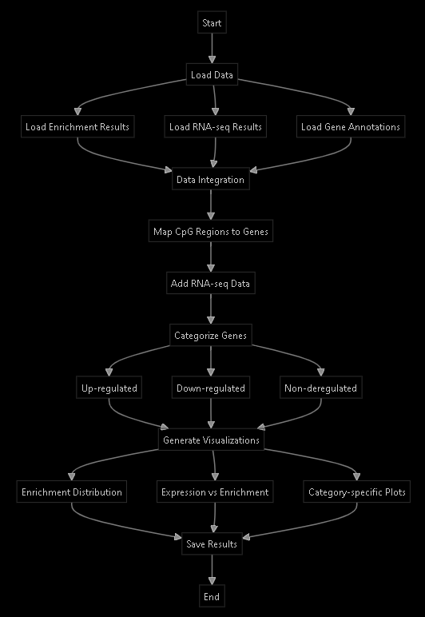

## `analyze_mecp2_cpg_enrichment` description:
**Purpose:**
This code analyzes the enrichment of MeCP2 at CpG islands by comparing exogenous and endogenous MeCP2 binding patterns.

**Key Components:**

1. **EnrichmentConfig Class**
   - Stores configuration parameters like thresholds and cutoffs
   - Controls quality filters for the analysis

2. **MeCP2CpGAnalyzer Class**
   Main class that handles:
   - Loading peak data
   - Loading CpG island locations
   - *Normalizing signals by sequencing depth*
   - Calculating enrichment scores
   - Visualizing results

3. **Main Analysis Flow:**
   - Loads peak files for both exogenous and endogenous samples
   - Calculates sequencing depths from BAM files
   - Processes CpG islands in chunks (for parallel processing)
   - Compares binding patterns between exo and endo samples
   - Generates statistical analysis and visualizations

**Flow Diagram:**


**Detailed Analysis Process:**

1. **Data Loading:**
   - Reads narrowPeak files
   - Loads CpG island coordinates
   - Calculates sequencing depths from BAM files for normalization

2. **Signal Processing:**
   - Normalizes peak signals by sequencing depth (*RPM normalization*)
   - Filters peaks based on quality thresholds
   - Identifies overlaps between peaks and CpG islands

3. **Enrichment Calculation:**
   - For each CpG island:
     - Finds overlapping peaks in both conditions
     - Calculates *width-weighted signals*
     - Computes enrichment scores (exo/endo ratio)
     - Performs statistical testing (*Mann-Whitney U test*)

4. **Results Processing:**
   - Categorizes regions as:
     - `both` (bound in both conditions)
     - `exo_only` (only exogenous binding)
     - `endo_only` (only endogenous binding)
   - Calculates additional metrics like peak widths
   - Flags *significant enrichment* based on thresholds

5. **Output Generation:**
   - Saves results in chunks for parallel processing
   - Creates visualizations:
     - Enrichment distribution plots
     - Signal comparison scatter plots

## Peaks and enrichment filtering:
1. **Initial Peak Loading Filter** in the `load_peak_data` method:
```python:scripts/analyze_mecp2_enrichment.py
def load_peak_data(self, peak_file: str) -> pd.DataFrame:
    try:
        peaks = pd.read_csv(peak_file, sep='\t', header=None,
                          names=['chr', 'start', 'end', 'name', 'score',
                                'strand', 'signalValue', 'pValue',
                                'qValue', 'peak'])
        
        # Basic quality filters
        peaks = peaks[
            (peaks['end'] > peaks['start']) &  # Filter 1: Valid peak width
            (peaks['signalValue'] > 0) &       # Filter 2: Positive signal
            (peaks['end'] - peaks['start'] >= self.config.min_peak_width)  # Filter 3: Minimum width
        ]
        
        return peaks
```

2. **Enrichment Analysis Filters** in the `calculate_enrichment_chunk` method:
```python:scripts/analyze_mecp2_enrichment.py
# Inside calculate_enrichment_chunk method
'significant': (
    enrichment >= self.config.min_fold_change and     # Filter 1: Minimum fold change
    exo_signal > self.config.min_signal_threshold and # Filter 2: Minimum signal strength
    pvalue < 0.05                                     # Filter 3: Statistical significance
)
```

These filters are controlled by the `EnrichmentConfig` class parameters:
```python:scripts/analyze_mecp2_enrichment.py
@dataclass
class EnrichmentConfig:
    """Configuration for enrichment analysis"""
    min_signal_threshold: float = 1.0    # Minimum signal strength required
    min_fold_change: float = 2.0         # Minimum fold change for significance
    max_qvalue: float = 0.05             # Maximum q-value for statistical significance
    min_peak_width: int = 50             # Minimum width of peaks in base pairs
```

The filtering process ensures:
1. Peaks have valid coordinates (end > start)
2. Peaks have positive signal values
3. Peaks meet *minimum width requirements*
4. Enrichment meets fold change threshold
5. Signal strength exceeds minimum threshold
6. Results are statistically significant

## Width-weighted signals:
The width-weighted signals are calculated in the `calculate_enrichment_chunk` method:
```python:scripts/analyze_mecp2_enrichment.py
def calculate_weighted_signal(overlaps_dict):
    signals = []
    for df in overlaps_dict.values():
        if df.empty:
            signals.append(0.0)
        else:
            # Calculate width-weighted signal for each peak and sum
            weighted_signal = np.sum(
                df['signalValue'] * (df['end'] - df['start'])  # Signal * Peak Width
            )
            signals.append(weighted_signal)
    return np.mean(signals) if signals else 0.0

# Usage in the method:
exo_signal = calculate_weighted_signal(exo_overlaps)
endo_signal = calculate_weighted_signal(endo_overlaps)
```

The width-weighted signal calculation:

1. **For each overlapping peak:**
   - Multiplies the peak's signal value by its width: `signalValue * (end - start)`
   - This gives more weight to wider peaks with the same signal value

2. **For statistical testing, individual peak signals are collected:**
```python:scripts/analyze_mecp2_enrichment.py
all_exo_signals = []
all_endo_signals = []

for df in exo_overlaps.values():
    if not df.empty:
        weighted_signals = df['signalValue'] * (df['end'] - df['start'])
        all_exo_signals.extend(weighted_signals)

for df in endo_overlaps.values():
    if not df.empty:
        weighted_signals = df['signalValue'] * (df['end'] - df['start'])
        all_endo_signals.extend(weighted_signals)
```

Example calculation:
```
Peak 1: signal = 10, width = 100bp → weighted_signal = 10 * 100 = 1000
Peak 2: signal = 10, width = 200bp → weighted_signal = 10 * 200 = 2000
```

This weighting scheme:
- Accounts for both *signal intensity and peak width*
- Gives more importance to broader peaks with the same signal intensity
- Helps normalize for different peak sizes when comparing binding regions

The final signal for a region is the *mean of these weighted signals across all replicates*, ensuring that both peak strength and width contribute to the enrichment calculation.

## `integrate_rna_seq` description: 

**Purpose:**
This code integrates RNA-seq differential expression data with MeCP2 binding data to understand the relationship between MeCP2 enrichment at CpG islands and gene expression changes.

**Flow Diagram:**


**Integration with MeCP2 Enrichment Results:**

1. **Input Data Sources:**
```python
class RNASeqIntegrator:
    def __init__(self, enrichment_file: str, rna_seq_file: str):
        # Load enrichment results from analyze_mecp2_cpg_enrichment.py
        self.enrichment_df = pd.read_csv(enrichment_file)
        # Load RNA-seq differential expression data
        self.rna_seq_df = pd.read_csv(rna_seq_file)
```

2. **Key Integration Steps:**

```python
def integrate_data(self, gene_annotations: pd.DataFrame) -> pd.DataFrame:
    integrated_data = []
    
    # For each significant MeCP2-enriched region
    for idx, region in self.significant_regions.iterrows():
        # Find nearest gene within 2kb
        nearby_genes = gene_annotations[
            (gene_annotations['chr'] == region['chr']) &
            ((gene_annotations['start'] - 2000 <= region['end']) &
             (gene_annotations['end'] + 2000 >= region['start']))
        ]
        
        # Get nearest gene and its distance
        distances = nearby_genes.apply(lambda x: min(
            abs(region['start'] - x['start']),
            abs(region['end'] - x['end'])
        ), axis=1)
        
        # Combine MeCP2 and RNA-seq data
        gene_data = {
            'gene': nearest_gene['gene_name'],
            'mecp2_enrichment': region['enrichment'],
            'exo_signal': region['exo_signal'],
            'endo_signal': region['endo_signal'],
            # Add RNA-seq data if available
            'log2FoldChange': expr['log2FoldChange'],
            'padj': expr['padj']
        }
```

3. **Gene Categorization:**
```python
def categorize_genes(self, integrated_results: pd.DataFrame):
    categories = {
        'up-regulated': expr_data[
            (expr_data['log2FoldChange'] > 0.5) &
            (expr_data['padj'] < 0.05)
        ],
        'down-regulated': expr_data[
            (expr_data['log2FoldChange'] < -0.5) &
            (expr_data['padj'] < 0.05)
        ],
        'non-deregulated': expr_data[
            ((expr_data['log2FoldChange'].abs() <= 0.5) |
             (expr_data['padj'] >= 0.05))
        ]
    }
```

**Connection with MeCP2 Enrichment Analysis:**

1. **Input from `analyze_mecp2_cpg_enrichment.py`:**
   - Enrichment scores (exo/endo ratio)
   - Signal values for both conditions
   - Peak locations and binding types
   - Statistical significance

2. **Integration Process:**
   - `Maps MeCP2-enriched regions to nearest genes`
   - Combines with RNA-seq differential expression data
   - Creates integrated view of binding and expression changes

3. **Output Analysis:**
   - Distribution of MeCP2 enrichment by gene category
   - Correlation between binding and expression changes
   - Identification of genes with both binding and expression changes

The code produces several visualizations and data files:
1. `mecp2_enriched_genes.csv`: Complete integrated dataset
2. `enrichment_distribution_by_category.pdf`: MeCP2 enrichment patterns
3. `mecp2_vs_expression.pdf`: Correlation between binding and expression


